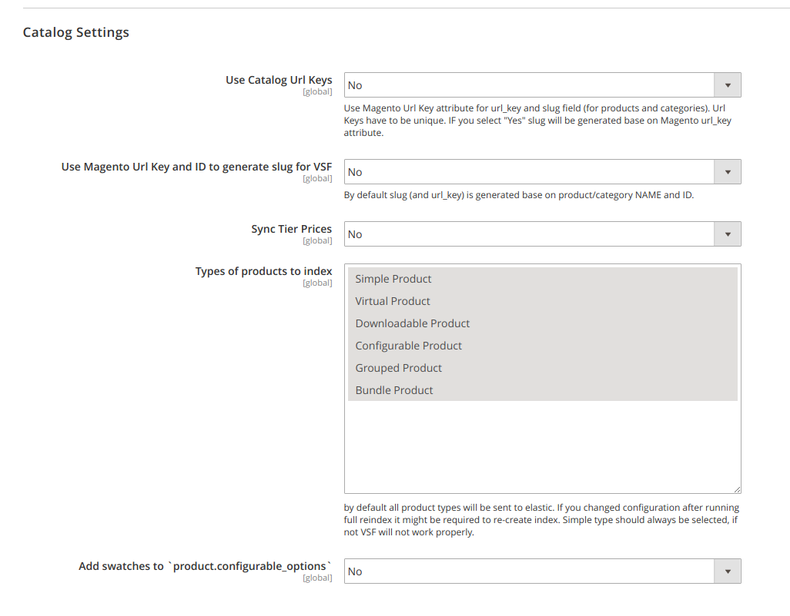

# Divante VueStorefrontIndexer Extension for Magento2


<a href="https://join.slack.com/t/vuestorefront/shared_invite/enQtMzA4MTM2NTE5NjM2LTI1M2RmOWIyOTk0MzFlMDU3YzJlYzcyYzNiNjUyZWJiMTZjZjc3MjRlYmE5ZWQ1YWRhNTQyM2ZjN2ZkMzZlNTg"></a>

This projects is a native, Magento2 data indexer for [Vue Storefront - first Progressive Web App for e-Commerce](https://github.com/DivanteLtd/vue-storefront). It fills the ElasticSearch data index with all the products, categories and static information required by Vue Storefront to work.

**Note on mage2vuestorefront project**: This native indexer updates the ElasticSearch index in the very same format like the [mage2vuestorefront](https://github.com/DivanteLtd/mage2vuestorefront). Our intention was to speed up the indexation process and make it more reliable. With native indexer we were able to use the Magento2 ORM and events to optimize the indexation process. Please do use this module instead of mage2vuestorefront if You experience any issues regarding indexing performance. Both projects are currently supported.

Vue Storefront is a standalone PWA storefront for your eCommerce, possible to connect with any eCommerce backend (eg. Magento, Pimcore, Prestashop or Shopware) through the API.

 ## Video demo
 [](https://www.youtube.com/watch?v=L4K-mq9JoaQ)
Sign up for a demo at https://vuestorefront.io/ (Vue Storefront integrated with Pimcore OR Magento2).

## Overview

## Installation/Getting Started

- Install with composer
```json
composer config repositories.divante vcs https://github.com/DivanteLtd/magento2-vsbridge-indexer
composer require divante/magento2-vsbridge-indexer:dev-master
```

```php
php bin/magento setup:upgrade
```
- Configure the module in Magento admin panel and run full indexation


### Configuration
Go to the new ‘Indexer’ section (Stores → Configuration → Vuestorefront → Indexer), available now in the in the Magento Panel, and configure it in the listed areas: 
 
1. General settings → List of stores to reindex
 
   Select stores for which data must be exported to ElasticSearch. By default stores 0 to 1 are selected. For each store view, a new, separate ElasticSearch index is created.

    

1. Elasticsearch Client

   Configure connection with ElasticSearch. Provide a host, port, and set up login and password (optionally).

   

1. Indicies settings
 
   Batch Indexing Size → select size of packages by which you intend to send data to ElasticSrearch. Depending on the project you might need to adjust package size to the number of products, attributes, configurable products variation, etc). By default Batch, Indexing Size is set up for 1000.
   Indicies settings
    
   Index Name Prefix → define prefixes for ElasticSearch indexes. The panel allows adding prefix only to the catalog name e.g.: "vue_storefront_catalog". For each store (store view) index name is generated on the base of defined prefix and ID. Aliases cannot be created. 
   Example: When we define following indexes: "vue_storefront_catalog_1", "vue_storefront_catalog_2", "vue_storefront_catalog_3", their name will remain unchanged, and only product and category names will be updated. 
   Important: It is crucial to update this configuration in the VSF and VSF-API (one change at the beginning of the whole configuration process).
   
   
   
1. Redis Cache Settings

    Clear cache → No/Yes (by default this option is disabled)
    
    VSF base Url → URL for VSF
 
    Invalidate Secret cache key → provide the same value as in the VSF configuration
 
    Connection timeout → by default set up for 10 seconds
    
     

1. Catalog Settings
    
    Use Short Catalog Urls → by default this option is disabled. The short Catalog Urls must be aligned with the VSF configuration. After any changes in the VSF configuration, the configuration in the Magento Panel must be updated and all products and categories indexed anew.
    
    Sync Tier Prices → by default this option is disabled. Used to sync products tier prices. 
    
    Types of products to index → by default all product will be exported to ElasticSearch. This option allows for selecting certain product types that should be exported. 
    
    

After updating the configuration, you can run the indexation.
It is also worth query ElasticSearch using CURL, to be sure that the communication works.

### Running the full indexation:
There are two options to run full indexations

1. Indexation of new indexes. 

In general, this indexation can be run in any order. It is worth, to begin with taxrule as it is the fastest.
```php
php bin/magento indexer:reindex vsbridge_taxrule_indexer
php bin/magento indexer:reindex vsbridge_attribute_indexer
php bin/magento indexer:reindex vsbridge_product_indexer
php bin/magento indexer:reindex vsbridge_category_indexer
php bin/magento indexer:reindex vsbridge_cms_block_indexer
php bin/magento indexer:reindex vsbridge_cms_page_indexer
```


2. Reindexation of all indexes

Recommended for smaller databases. In the case of big databases it is better to run commands manually. 
```php
php bin/magento indexer:reindex
```

Note: If a docker with ElasticSearch is disabled, Indexer will display error: "No alive nodes found in your cluster".

#### Update on Save Mode

*Update on Save* mode works for the following operations:

- save/delete the product
- save/delete the category 
- save/delete the static block 
- save/delete the static page 
- save/delete the attribute (deleting the attribute causes displaying “invalid” status for vsbridge products indexer).

#### Update on Schedule Mode

*Update on Schedule* mode observes changes in corresponding tables, and probably will be more relevant in most cases. It is the default mode in any bigger stores.
     
### Compatibility

Module was tested on:
 -- Magento Community version 2.2.0 and 2.2.4. It should perform without any issues on all Magento 2.2.x versions. 
 -- Magento Enterprise version 2.3.0. The bridge indexer cannot be installed on lower versions of Magento Enterprise.

Module was not tested on version 2.3.

### TODO
- check the Vue Storefront - Magento 2 Indexer bridge for Magento 2.3 (for Commerce and Enterprise versions).
- add MSI support
- add rating review to ElasticSearch as a separate module @Agata 
- add a limitation of the attributes (products, categories) sent to ElasticSearch
- add a limitation of the categories sent to ElasticSearch, by adding new configurations: send only categories visible in the menu, send only active categories @Agata
- add a new command enabling the full indexation, which will run all the indexes necessary for VSF   
- add a new command allowing to enable/disable following indexes: CMS Block, CMS Page.
- add an option to exclude the default Magento indexes (which do not impact new indexes operations)
- adding "label" for configurable_options: configurable_options.label https://github.com/DivanteLtd/mage2vuestorefront/commit/ee77819aca915cc324a1b54d621c904ac8bc8fde @Agata
